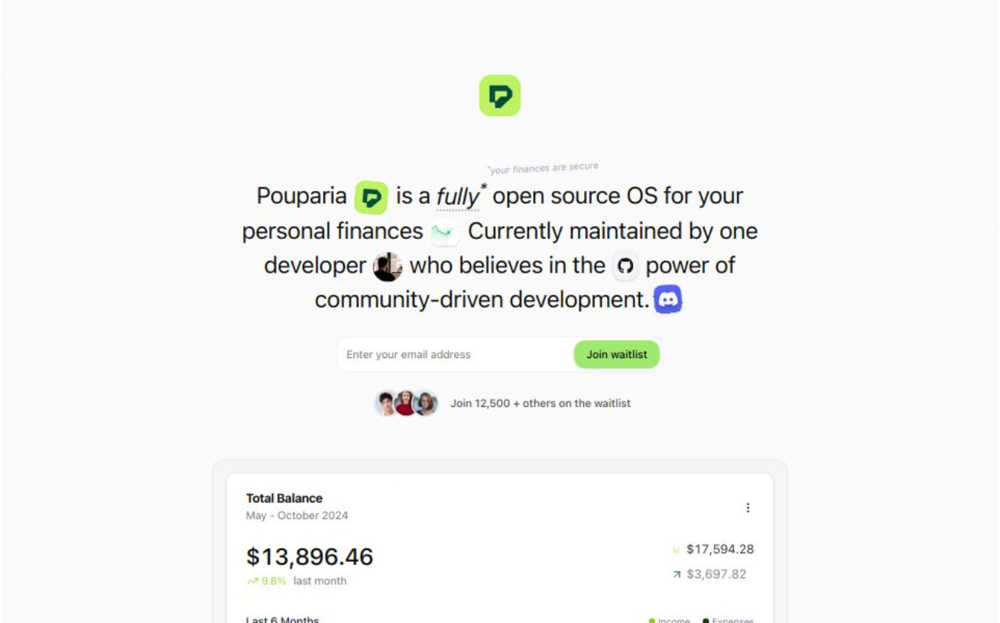

# Pouparia (WIP)

> Your finances are secure and open-source

A personal finance management application built with Next.js, React Query, and Prisma, focused on security, transparency, and community-driven development.


## Preview



## Features

- 📊 Real-time financial tracking and analysis
- 💰 Support for multiple currencies
- 📱 Responsive design for all devices
- 🔐 Secure authentication with Clerk
- 📈 Interactive charts and visualizations
- 🎯 Custom categories for income and expenses
- 📅 Date range filtering for transactions
- 💾 Persistent data storage with Prisma

## Tech Stack

- **Frontend**: Next.js, React, TailwindCSS, shadcn/ui
- **Backend**: Next.js API routes
- **Database**: Prisma ORM
- **Authentication**: Clerk
- **State Management**: TanStack Query
- **Charts**: Recharts
- **UI Components**: Radix UI

## Getting Started

1. Clone the repository:
```bash
git clone https://github.com/yourusername/pouparia.git
cd pouparia
```

2. Install dependencies:
```bash
npm install
```

3. Configure environment variables:
```bash
cp .env.example .env.local
```

4. Set up your database and update the connection string in `.env.local`

5. Run database migrations:
```bash
npx prisma migrate dev
```

6. Start the development server:
```bash
npm run dev
```

## Contributing

Contributions are welcome! Please feel free to submit a Pull Request. For major changes, please open an issue first to discuss what you would like to change.

1. Fork the Project
2. Create your Feature Branch (`git checkout -b feature/AmazingFeature`)
3. Commit your Changes (`git commit -m 'Add some AmazingFeature'`)
4. Push to the Branch (`git push origin feature/AmazingFeature`)
5. Open a Pull Request

## License

This project is licensed under the MIT License - see the [LICENSE](LICENSE) file for details.

## Support

If you find any bugs or have feature suggestions, please create an issue in the GitHub repository.

## Acknowledgments

- Thanks to all contributors who help make Pouparia better
- Built with [shadcn/ui](https://ui.shadcn.com/) components
- Powered by [Next.js](https://nextjs.org/)
